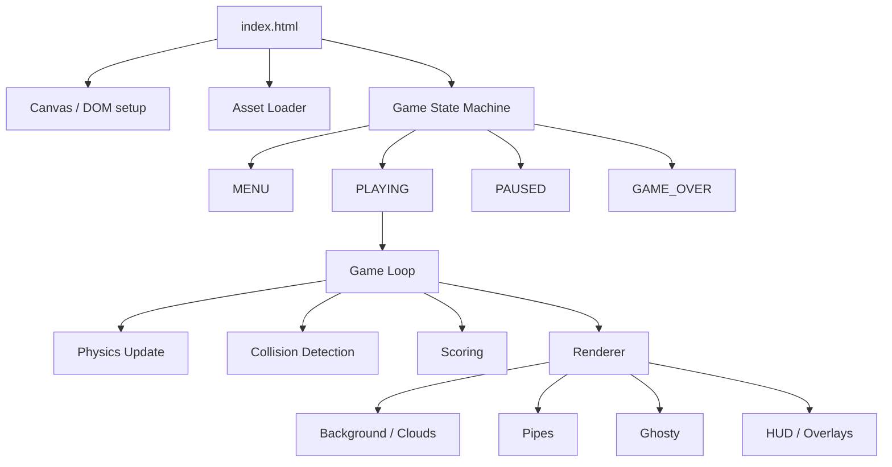

# Design Document: Flappy Kiro

## Overview

Flappy Kiro is a single-file browser game (HTML5 Canvas + vanilla JS) with no build step. The player guides Ghosty — a ghost sprite — through an endless series of pipe obstacles. The game features retro/sketchy visuals, parallax clouds, sound effects, and a localStorage-persisted high score.

The entire game ships as one `index.html` file that references assets from the `assets/` directory. No frameworks, no bundlers, no server required.

### Key Design Decisions

- **Single file, no dependencies**: All game logic lives in one `<script>` block inside `index.html`. This keeps deployment trivial and matches the "no build step" requirement.
- **Central CONFIG object**: All tunable numeric constants live in a single `CONFIG` object at the top of the script. No magic numbers are scattered through the code — every system reads from `CONFIG`. This makes balancing and tweaking trivial without touching game logic.
- **Fixed-resolution canvas**: 480×640 px canvas, CSS-scaled to fit the viewport. Physics values are expressed in canvas pixels per frame at 60 fps.
- **Fixed timestep physics, interpolated rendering**: Physics runs at a fixed 60 fps tick. The render loop uses `requestAnimationFrame` and interpolates between the last two physics states for smooth visuals at any display refresh rate.
- **State machine**: A single `gameState` string drives all branching logic, making transitions explicit and easy to reason about.
- **Object pooling for pipes**: Pipe objects are recycled from a fixed-size pool rather than allocated/GC'd each spawn cycle, keeping frame times consistent.

---

## Architecture

The game is structured as a single HTML file with an inline `<script>`. Internally the code is organized into logical modules (plain JS objects/functions — no ES modules needed):



### Game Loop Design

The loop uses a **fixed-timestep accumulator** pattern:

```
requestAnimationFrame(loop)
  accumulator += deltaTime
  while accumulator >= FIXED_STEP:
    physicsUpdate()
    accumulator -= FIXED_STEP
  alpha = accumulator / FIXED_STEP
  render(alpha)   // interpolate between prev and current state
```

This decouples physics from frame rate. At 60 fps the accumulator drains exactly once per frame. At higher refresh rates it may drain zero or two times, but rendering always interpolates smoothly.

---

## Components and Interfaces

### Asset Loader

Loads `ghosty.png`, `jump.wav`, and `game_over.wav` before the game starts. Exposes:

```js
assets = {
  ghosty: HTMLImageElement,
  jumpSound: HTMLAudioElement,
  gameOverSound: HTMLAudioElement
}
```

Plays audio by cloning the audio element (allows overlapping playback):
```js
function playSound(audio) {
  audio.cloneNode().play();
}
```

### Central CONFIG Object

All tunable constants are declared in a single `CONFIG` object at the top of the script. Game systems reference `CONFIG.*` — never raw literals.

```js
const CONFIG = {
  // Canvas
  canvasWidth:       480,
  canvasHeight:      640,

  // Physics
  gravity:           0.5,    // px/frame²
  flapVelocity:     -8,      // px/frame (upward)
  terminalVelocity:  12,     // px/frame (downward cap)
  maxTiltUp:        -25,     // degrees
  maxTiltDown:       90,     // degrees
  tiltVelocityScale: 4,      // multiplier: angle = clamp(vy * scale, tiltUp, tiltDown)

  // Ghosty
  ghostWidth:        40,     // px
  ghostHeight:       40,     // px
  ghostX:            120,    // fixed horizontal position

  // Pipes
  pipeStartSpeed:    2.5,    // px/frame
  pipeSpacing:       220,    // px between leading edges
  pipeGap:           160,    // px gap height
  pipeWidth:         60,     // px
  pipeCapWidth:      72,     // px
  pipeCapHeight:     20,     // px
  gapMargin:         60,     // min px from canvas edge
  speedIncrement:    0.4,    // px/frame added per milestone
  speedMilestone:    5,      // pipes passed per speed step
  maxSpeed:          6.0,    // px/frame hard cap

  // Collision
  hitboxInset:       4,      // px inset on all sides for Ghosty circle radius
  invincibilityMs:   500,    // ms of invincibility after pipe hit
  flashIntervalMs:   80,     // ms between flash toggles

  // Particles
  particlesPerFrame: 2,
  particleLife:      20,     // frames
  particleRadius:    3,      // px

  // Screen shake
  shakeFrames:       18,     // frames of shake after collision
  shakeMagnitude:    6,      // max px offset

  // Score popup
  popupLife:         40,     // frames
  popupRiseSpeed:    1,      // px/frame upward

  // Clouds
  cloudLayers: [
    { speed: 0.3, opacity: 0.25 },   // far layer
    { speed: 0.7, opacity: 0.55 }    // near layer
  ]
};
```

### State Machine

```js
let gameState = 'MENU'; // 'MENU' | 'PLAYING' | 'PAUSED' | 'GAME_OVER'

function setState(newState) { ... }
```

Transitions:
- `MENU → PLAYING` on Space/click
- `PLAYING → PAUSED` on Escape
- `PAUSED → PLAYING` on Escape
- `PLAYING → GAME_OVER` on collision
- `GAME_OVER → PLAYING` on Space/click (full reset)

### Ghosty (Player)

```js
const ghosty = {
  x: CONFIG.ghostX,       // fixed horizontal position
  y: 320,                 // current physics y
  prevY: 320,             // previous physics y (for interpolation)
  vy: 0,                  // vertical velocity (px/frame)
  width: CONFIG.ghostWidth,
  height: CONFIG.ghostHeight,
  invincible: false,
  invincibleTimer: 0,
  flashVisible: true
}
```

Rotation mapping: `angle = clamp(vy * CONFIG.tiltVelocityScale, CONFIG.maxTiltUp, CONFIG.maxTiltDown)` degrees.

### Pipe System

```js
const pipeState = {
  pipes: [],          // active PipeObjects (drawn from pool)
  pool: [],           // recycled PipeObjects waiting for reuse
  speed: CONFIG.pipeStartSpeed,
  spawnTimer: 0,
  pipesPassed: 0
}

// PipeObject shape:
{
  x: Number,          // left edge of pipe body
  gapY: Number,       // vertical centre of gap
  scored: Boolean,    // whether this pipe has been counted
  active: Boolean     // pool management flag
}
```

Pipe objects are never garbage-collected mid-session. When a pipe scrolls off-screen it is returned to `pipeState.pool` and reset when the next spawn is needed.

### Collision Detection

Ghosty uses a **circle** hitbox (better fit for a round ghost sprite). Pipes use **axis-aligned rectangles**. Ground and ceiling are simple Y-boundary checks.

**Ghosty circle** — derived from the inset constant:
```js
function ghostyCircle() {
  const r = (Math.min(ghosty.width, ghosty.height) / 2) - CONFIG.hitboxInset;
  return {
    cx: ghosty.x + ghosty.width  / 2,
    cy: ghosty.y + ghosty.height / 2,
    r
  };
}
```

**Pipe rectangles** — one rect for the top pipe (body + cap), one for the bottom:
```js
function pipeRects(pipe) {
  const gapTop    = pipe.gapY - CONFIG.pipeGap / 2;
  const gapBottom = pipe.gapY + CONFIG.pipeGap / 2;
  return [
    // top pipe (extends from y=0 down to gapTop)
    { x: pipe.x, y: 0,        w: CONFIG.pipeWidth, h: gapTop },
    // bottom pipe (extends from gapBottom down to canvas bottom)
    { x: pipe.x, y: gapBottom, w: CONFIG.pipeWidth, h: CONFIG.canvasHeight - gapBottom }
  ];
}
```

**Circle–rectangle overlap test** (exact, no AABB approximation):
```js
function circleRectOverlap(c, r) {
  // Find the closest point on the rect to the circle centre
  const nearX = Math.max(r.x, Math.min(c.cx, r.x + r.w));
  const nearY = Math.max(r.y, Math.min(c.cy, r.y + r.h));
  const dx = c.cx - nearX;
  const dy = c.cy - nearY;
  return dx * dx + dy * dy < c.r * c.r;
}
```

**Ground / ceiling detection** (checked every physics tick, bypasses invincibility):
```js
function checkBoundaries() {
  const c = ghostyCircle();
  if (c.cy + c.r >= CONFIG.canvasHeight) triggerGameOver(); // ground
  if (c.cy - c.r <= 0)                   triggerGameOver(); // ceiling
}
```

Each frame during PLAYING, `checkBoundaries()` runs first, then circle–rect tests against each active pipe rect.

### Scoring

```js
const scoreState = {
  score: 0,
  highScore: parseInt(localStorage.getItem('flappyKiroHigh') || '0')
}
```

Score increments when `ghosty.x > pipe.x + PIPE_WIDTH / 2` and `!pipe.scored`.

### Cloud / Background Renderer

Two parallax cloud layers:

```js
const cloudLayers = [
  { clouds: [...], speed: 0.3, opacity: 0.25 },  // far layer
  { clouds: [...], speed: 0.7, opacity: 0.55 }   // near layer
]
```

Each cloud is a simple rounded rectangle drawn with Canvas 2D API.

### Audio / Visual Feedback

- **Screen shake**: On collision, offset the canvas transform by a random small delta for ~300 ms.
- **Particle trail**: Each frame during PLAYING, emit 1–2 small semi-transparent circles behind Ghosty that fade out over ~20 frames.
- **Flash animation**: During invincibility frames, toggle `ghosty.flashVisible` every 80 ms.
- **Score pop**: When score increments, render a "+1" text that floats upward and fades over ~40 frames.

---

## Data Models

### GameState (string enum)

```
'MENU' | 'PLAYING' | 'PAUSED' | 'GAME_OVER'
```

### GhostyState

| Field | Type | Description |
|---|---|---|
| x | number | Fixed horizontal canvas position |
| y | number | Current physics Y position |
| prevY | number | Previous frame physics Y (interpolation) |
| vy | number | Vertical velocity (px/frame) |
| width | number | Sprite render width |
| height | number | Sprite render height |
| invincible | boolean | Whether invincibility frames are active |
| invincibleTimer | number | ms remaining in invincibility period |
| flashVisible | boolean | Current flash toggle state |

### PipeObject

| Field | Type | Description |
|---|---|---|
| x | number | Left edge of pipe body |
| gapY | number | Vertical centre of the gap |
| scored | boolean | Whether this pipe has been counted for score |

### CloudObject

| Field | Type | Description |
|---|---|---|
| x | number | Current X position |
| y | number | Fixed Y position |
| w | number | Width |
| h | number | Height |

### Particle

| Field | Type | Description |
|---|---|---|
| x | number | Current X |
| y | number | Current Y |
| life | number | Remaining life (frames) |
| maxLife | number | Initial life (for alpha calculation) |
| r | number | Radius |

### ScorePopup

| Field | Type | Description |
|---|---|---|
| x | number | Spawn X |
| y | number | Current Y (floats upward) |
| life | number | Remaining life (frames) |

### PersistenceSchema (localStorage)

| Key | Value | Description |
|---|---|---|
| `flappyKiroHigh` | string (integer) | Serialized high score |


---

## Correctness Properties

*A property is a characteristic or behavior that should hold true across all valid executions of a system — essentially, a formal statement about what the system should do. Properties serve as the bridge between human-readable specifications and machine-verifiable correctness guarantees.*

### Property 1: Flap sets velocity

*For any* Ghosty state during PLAYING, when a flap input is received (Space key or canvas click), Ghosty's vertical velocity should be set to exactly `FLAP_VY` (-8 px/frame), regardless of the previous velocity value.

**Validates: Requirements 2.1, 2.2, 3.2**

---

### Property 2: Flap is ignored outside PLAYING

*For any* game state that is not PLAYING (MENU, PAUSED, GAME_OVER), receiving a flap input should leave Ghosty's vertical velocity unchanged.

**Validates: Requirements 2.3**

---

### Property 3: Physics tick invariant

*For any* Ghosty state with velocity `vy` and position `y`, after one physics tick: the new velocity should be `clamp(vy + GRAVITY, -Infinity, TERMINAL_VY)` and the new position should be `y + newVy`.

**Validates: Requirements 3.1, 3.3, 3.4**

---

### Property 4: Interpolated render position

*For any* alpha value in [0, 1] and any pair of (prevY, currentY), the interpolated render Y should equal `prevY + alpha * (currentY - prevY)`.

**Validates: Requirements 3.5**

---

### Property 5: Sprite rotation is clamped

*For any* vertical velocity `vy`, the computed rotation angle should satisfy `MAX_TILT_UP <= angle <= MAX_TILT_DOWN` (i.e., between -25° and 90°).

**Validates: Requirements 3.6**

---

### Property 6: Pipe gap centre is within bounds

*For any* spawned pipe, the gap centre `gapY` should satisfy:
`GAP_MARGIN + GAP_SIZE/2 <= gapY <= CANVAS_HEIGHT - GAP_MARGIN - GAP_SIZE/2`
(i.e., the full gap fits within the canvas with the required margin).

**Validates: Requirements 4.3, 4.4**

---

### Property 7: Pipe scrolls by speed each tick

*For any* pipe at position `x` and any current `pipeSpeed`, after one physics tick the pipe's position should be `x - pipeSpeed`.

**Validates: Requirements 4.2**

---

### Property 8: Off-screen pipes are removed

*For any* pipe whose right edge (`x + PIPE_WIDTH`) is less than 0 after a tick, that pipe should not appear in the active pipes array.

**Validates: Requirements 4.7**

---

### Property 9: Pipe speed is capped

*For any* number of pipes passed, the current `pipeSpeed` should never exceed `MAX_SPEED` (6 px/frame), and should increase by `SPEED_INCREMENT` (0.4) for every `SPEED_MILESTONE` (5) pipes passed.

**Validates: Requirements 4.5**

---

### Property 10: Ghosty circle hitbox radius is correct

*For any* Ghosty width and height, the collision circle radius should equal `(Math.min(width, height) / 2) - CONFIG.hitboxInset`, and the circle centre should be at `(ghosty.x + width/2, ghosty.y + height/2)`.

**Validates: Requirements 5.1**

---

### Property 11: Collision triggers game over after invincibility

*For any* overlapping (Ghosty hitbox, pipe) pair, a collision response should be triggered, invincibility should be set for 500 ms, and after the invincibility period expires the game state should become GAME_OVER.

**Validates: Requirements 5.3, 5.4, 5.5**

---

### Property 12: Game state is always valid

*For any* sequence of inputs and events, `gameState` should always be one of the four valid values: `'MENU'`, `'PLAYING'`, `'PAUSED'`, or `'GAME_OVER'`.

**Validates: Requirements 6.1**

---

### Property 13: Pause is a round-trip

*For any* PLAYING state, pressing Escape transitions to PAUSED; pressing Escape again transitions back to PLAYING. The game loop should be frozen in PAUSED and running in PLAYING.

**Validates: Requirements 6.4, 6.5**

---

### Property 14: Game reset clears state

*For any* GAME_OVER state, receiving a Space/click input should transition to PLAYING with `score === 0` and an empty `pipes` array.

**Validates: Requirements 6.7, 8.3, 8.4**

---

### Property 15: High score persistence round-trip

*For any* score value that exceeds the current high score at game over, saving to localStorage and then reading it back should return the same value.

**Validates: Requirements 6.8, 7.3, 7.4**

---

### Property 16: Score increments on pipe pass

*For any* pipe that Ghosty's x position crosses (Ghosty.x > pipe.x + PIPE_WIDTH/2) and that has not yet been scored, the score should increase by exactly 1 and the pipe should be marked as scored.

**Validates: Requirements 7.1**

---

### Property 17: HUD format is correct

*For any* integer values of `score` and `highScore`, the rendered HUD string should match the pattern `"Score: {score} | High: {highScore}"`.

**Validates: Requirements 7.2**

---

### Property 18: Cloud layers have distinct speeds and opacities

*For any* two cloud layers, their scroll speeds should differ and their opacity values should both be in (0, 1) and be distinct from each other.

**Validates: Requirements 9.3, 9.4**

---

## Performance

### Target

60 FPS on mid-range hardware. The fixed-timestep loop ensures physics consistency; the render path must stay under ~8 ms per frame.

### Object Pooling (Pipes)

Pipes are never allocated after game start. A fixed pool of `Math.ceil(CONFIG.canvasWidth / CONFIG.pipeSpacing) + 2` objects is created at init. When a pipe scrolls off-screen it is returned to the pool (`active = false`). Spawning pulls from the pool and resets fields — no `new` calls, no GC pressure mid-session.

```js
function acquirePipe(x, gapY) {
  const p = pipeState.pool.find(p => !p.active) || { active: false };
  p.x = x; p.gapY = gapY; p.scored = false; p.active = true;
  return p;
}

function releasePipe(p) {
  p.active = false;
  pipeState.pool.push(p); // idempotent if already in pool
}
```

### Sprite Batching

All canvas draw calls are grouped by type to minimise `save/restore` and `globalAlpha` state changes:

1. Background fill
2. Far cloud layer (single `globalAlpha` set once)
3. Near cloud layer (single `globalAlpha` set once)
4. All pipes (single fill/stroke style set once, loop over active pipes)
5. Particles (single `globalAlpha` loop)
6. Ghosty sprite (one `drawImage`)
7. HUD / overlays (text on top)

### Particle Budget

The particle array is capped at `CONFIG.particlesPerFrame * CONFIG.particleLife` entries. Expired particles are overwritten in-place (ring buffer) rather than spliced out, avoiding array reallocation.

### Canvas State Minimisation

`ctx.save()` / `ctx.restore()` are only called when rotation or translation is needed (Ghosty sprite, screen shake). All other draw calls use direct property assignment.

---

## Error Handling

### Asset Loading Failures

If `ghosty.png`, `jump.wav`, or `game_over.wav` fail to load, the game should degrade gracefully:
- Missing sprite: render a simple ghost shape using Canvas 2D primitives as a fallback.
- Missing audio: wrap all `playSound` calls in try/catch; silence is acceptable, the game continues.
- Display a console warning for each failed asset.

### Audio Playback Errors

Browsers may block autoplay. All `audio.play()` calls return a Promise; unhandled rejections should be caught and silenced. The game must remain fully playable without audio.

### localStorage Unavailability

`localStorage` may be unavailable (private browsing, storage quota exceeded). All reads/writes should be wrapped in try/catch. If unavailable, the high score defaults to 0 and is not persisted — the game continues normally.

### Canvas Context Unavailability

If `canvas.getContext('2d')` returns null, display a static error message in the page body and halt initialization.

### Out-of-Bounds Physics

Boundary collisions (top/bottom canvas edge) are handled as game-over triggers, preventing Ghosty from ever leaving the canvas in a live session.

---

## Testing Strategy

### Dual Testing Approach

Both unit tests and property-based tests are required. They are complementary:
- **Unit tests** verify specific examples, integration points, and edge cases.
- **Property tests** verify universal invariants across randomized inputs.

### Property-Based Testing Library

Use **fast-check** (JavaScript) for property-based tests. Install via CDN or npm:
```
npm install --save-dev fast-check
```

Each property test must run a minimum of **100 iterations**.

Each test must include a comment tag in the format:
```
// Feature: flappy-kiro, Property N: <property text>
```

### Unit Tests (Jest or Vitest)

Focus on:
- Asset loader resolves all three assets (Req 1.2)
- Canvas dimensions are 480×640 (Req 1.4)
- Initial game state is MENU (Req 6.2)
- MENU → PLAYING transition on input (Req 6.3)
- Game over stops loop and plays sound (Req 8.1)
- Collision invincibility timer is set to 500 ms (Req 5.4)
- Boundary edge cases: Ghosty at y=0 and y=CANVAS_HEIGHT triggers game over (Req 3.7, 3.8)

### Property Tests (fast-check)

One property-based test per correctness property:

| Test | Property | fast-check Arbitraries |
|---|---|---|
| Flap sets velocity | Property 1 | `fc.float()` for initial vy |
| Flap ignored outside PLAYING | Property 2 | `fc.constantFrom('MENU','PAUSED','GAME_OVER')` |
| Physics tick invariant | Property 3 | `fc.float()` for vy, `fc.float()` for y |
| Interpolated render position | Property 4 | `fc.float({min:0,max:1})` for alpha, `fc.float()` for prevY/currentY |
| Sprite rotation clamped | Property 5 | `fc.float()` for vy |
| Pipe gap within bounds | Property 6 | `fc.integer()` seed for gap centre generation |
| Pipe scrolls by speed | Property 7 | `fc.float()` for x, `fc.float({min:0})` for speed |
| Off-screen pipes removed | Property 8 | `fc.float({max:-PIPE_WIDTH})` for pipe x |
| Pipe speed capped | Property 9 | `fc.integer({min:0,max:1000})` for pipes passed |
| Ghosty hitbox inset | Property 10 | `fc.float()` for x/y, `fc.integer({min:9})` for width/height |
| Collision → game over | Property 11 | Overlapping rect pairs |
| Game state always valid | Property 12 | `fc.array(fc.constantFrom('flap','escape','click','gameover'))` |
| Pause round-trip | Property 13 | Any PLAYING state |
| Game reset clears state | Property 14 | Any GAME_OVER state with random score/pipes |
| High score persistence | Property 15 | `fc.integer({min:0})` for score values |
| Score increments on pass | Property 16 | Random pipe positions relative to Ghosty |
| HUD format | Property 17 | `fc.integer({min:0})` for score and highScore |
| Cloud layer distinctness | Property 18 | Generated cloud layer configs |

### Test File Structure

```
tests/
  unit/
    assets.test.js
    canvas.test.js
    gameState.test.js
    collision.test.js
  property/
    physics.property.test.js
    pipes.property.test.js
    scoring.property.test.js
    state.property.test.js
    rendering.property.test.js
```

### Running Tests

```bash
npx vitest --run
```
